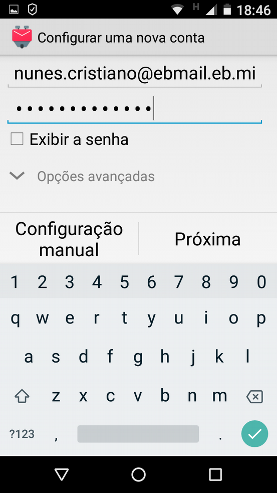

*Lang: pt-br*
# **Tutorial para configuração do EBmail em Smartphone Android**

### Considerações Iniciais:
- O tutorial tem o objetivo de popularizar o uso do EBmail no ambiente coorporativo dentro da instituição, incentivando a tramitação de dados ligados ao serviço em servidores internos da organização (CITEX);
- O objetivo do tutorial também é oferecer uma forma acesso ao EBmail fácil, simples e semelhante as grandes soluções proprietárias;
- Todos os software envolvidos no tutorial são de código aberto e de credibilidade alta na comunidade.

---

### **Instruções**

#### PASSO 1
- Conecte seu smartphone em uma rede com acesso à internet (não utilizar EBnet);
- Em seu smartphone, acesse a central de aplicativos “Play Store” e procure  por “K-9 Mail”;
- Instale o aplicativo “K-9 Mail”;
- O atalho para aplicação será criado após a instalação.

 | 

#### PASSO 2
- Abra o aplicativo através do atalho, insira o seu email **meulogin@ebmail.eb.mil.br** e senha e clique em próxima.

 |  | 

#### PASSO 3
- Escolha o tipo de conta IMAP, preencha as configurações do Servidor IMAP: 
> servidor IMAP: `ebmail.eb.mil.br`   
> segurança: SSL/TSL  
> porta: **`993`**  
> usuário: `meulogin@eb.mil.br`  
> autenticação: senha normal  
> senha: sua_senha. 
- Preencha as configurações do Servidor SMTP: 
> servidor SMTP: `ebmail.eb.mil.br`  
> segurança: SSL/TSL  
> porta: **`465`**  
> requer autenticação: sim  
> usuário: `meulogin@eb.mil.br`  
> autenticação: senha normal  
> senha: sua_senha  

 |  | 

#### PASSO 4
- Dê um nome para sua conta de email, **EBmail**; 
- Coloque o seu posto/ grad nome. Após isso aparecerá a conta “EBmail”, clique nela; 
- Se você cadastrou somente a conta do EBmail o aplicativo o definirá ela como conta padrão e sempre que você abrir ele em seu smartphone será conduzido diretamente para a Caixa de entrada de seu EBmail, vide a terceira imagem abaixo.

 |  | 

#### Possíveis Erros e Sugestões
- Quando você for configurar os servidores IMAP e SMTP aparecerá os campos já preenchidos, entre eles o usuário: **`meulogin@ebmail.eb.mil.br`** que deve ser  Substituído por **`meulogin@eb.mil.br`**.
- Você também pode agregar outras contas de emails coorporativos, por exemplo:
**`3sgtjoao@9bcomge.eb.mil.br`**, para ser aberto na mesma tela do aplicativo. 
- Para fazer isto basta obter as configurações do servidor de email zimbra de sua organização e seguir os mesmos passos citados anteriormente ou solicitar suporte à Seção de Tecnologia da Informação.

#### Resumo das Considerações Técnicas para a Configuração
- Sobre o software K9-email para Android:
    1. Página do projeto: https://k9mail.github.io/
    2. Repositório oficial do código do projeto: https://github.com/k9mail/k-9

- Parâmetro de configuração do EBmail https://ebmail.eb.mil.br para qualquer cliente de email:  
  
**Configurações do Servidor de Entrada**  
Servidor | IMAP ebmail.eb.mil.br
---------------- | -------------------------
Segurança | SSL/TSL
Porta | 993
Usuário | meulogin@eb.mil.br
Autenticação | Senha Normal
Senha s| enha_do_email_do_usuario

**Configurações do Servidor de Saída**  
Servidor SMTP | ebmail.eb.mil.br
---------------- | -------------------------
Segurança | SSL/TSL
Porta | 465
Requer Autenticação | Sim
Usuário | meulogin@eb.mil.br
Autenticação | Senha Normal
Senha | senha_do_email_do_usuario

---

Author: *Cristiano Monteiro*  
2018 June 19