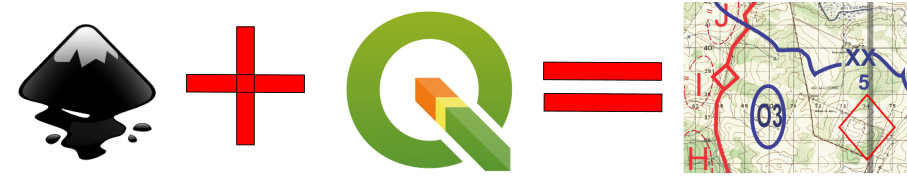
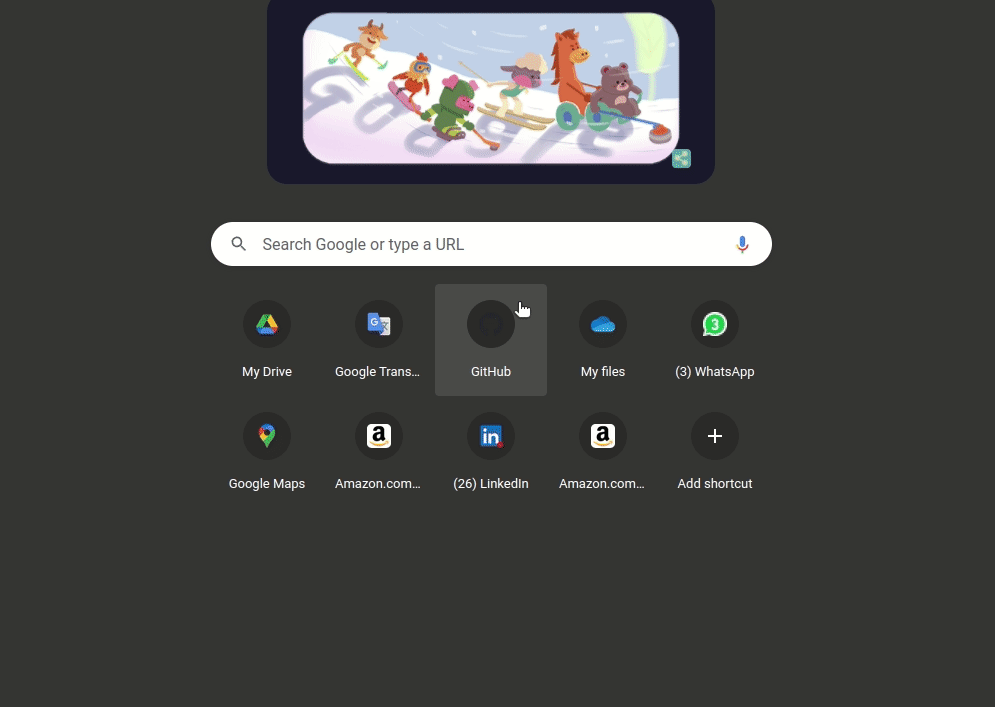
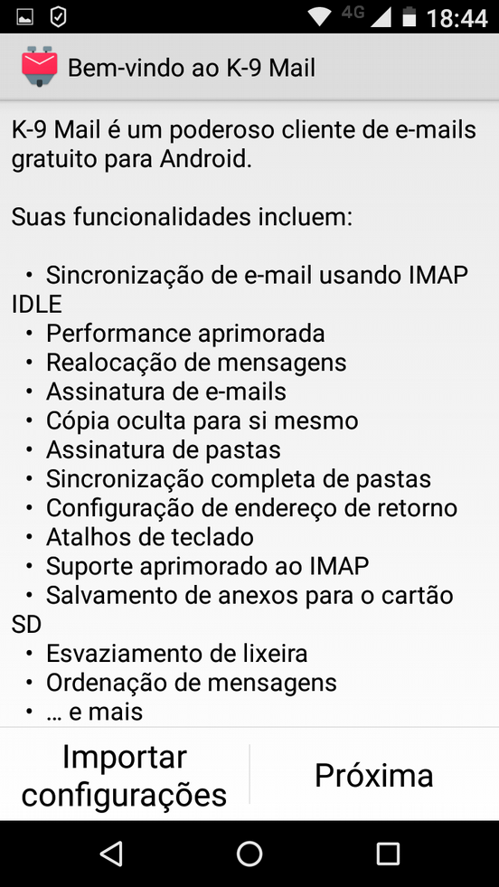

*Lang: pt-br*
# **Planejamento em Cartas Militares Digital**

### Considerações Iniciais:
- O tutorial tem o objetivo de difundir conhecimentos sobre planejamento tático para operações militares;
- A necessidade do tutorial foi identificada através da realização do Curso de Aperfeiçoamento de Oficiais na [Escola de Aperfeiçoamento de Oficiais](http://www.esao.eb.mil.br/) (EsAO) no ano de 2022. Existia uma demanda pela realização de estudos táticos de maneira digital e produção de produtos do estudo na forma de artefatos digitais (cartas militares de alta resolução, imagens vetorizadas, imagens rasterizadas, desenho de calcos de operações, etc);
- Para execução do planejamento tático em carta digital, foram adotados os softwares **QGIS** e **Inkscape**, ambos softwares de código aberto e de credibilidade alta na comunidade;
- Futuramente as idéias aqui contidas podem fomentar o desenvolvimento de uma solução integrada optimizada para atender os requisitos de uso do planejador tático militar.

> **QGIS**: É um sistema de aplicação para informações geográficas que suporta visualização, edição e análise geospacial de dados.
> **Inkscape**: Editor de imagens vetorizadas.

 facilita substanciamente a produção de artefatos de planejamento tático


- QGIS 
- QGIS is a free and open-source cross-platform desktop geographic information system application that supports viewing, editing, and analysis of geospatial data.
- O tutorial tem o objetivo de popularizar o uso do EBmail no ambiente coorporativo dentro da instituição, incentivando a tramitação de dados ligados ao serviço em servidores internos da organização (CITEX);
- O objetivo do tutorial também é oferecer uma forma acesso ao EBmail fácil, simples e semelhante as grandes soluções proprietárias;
- Todos os software envolvidos no tutorial .

---

### **Instruções**

#### PASSO 1: Download e instalação dos softwares
[]() 
##### **-> Inkscape**
- Windows:
    - Realize o [download](https://inkscape.org/release/1.1.2/windows/64-bit/) do binário e instale seguindo as instruções da interface gráfica. 
- MacOS:
    - Realize o [download](https://inkscape.org/gallery/item/31681/Inkscape-1.1.2.dmg) e arraste o instalador para a pasta de aplicativos.
- GNU/Linux: (Debian/ Ubuntu)
    - Encontra-se nos repositórios e também na forma de pacote [Snap](https://snapcraft.io/inkscape) e [Appimage](https://inkscape.org/release/all/gnulinux/appimage/).
```bash
sudo apt update && sudo apt install qgis inkscape
```
##### **-> QGIS**
- Windows:
    - Realize o [download](https://qgis.org/downloads/QGIS-OSGeo4W-3.22.4-1.msi) do binário e instale seguindo as instruções da interface gráfica. 
- MacOS:
    - Realize o [download](https://qgis.org/downloads/macos/qgis-macos-ltr.dmg) e arraste o instalador para a pasta de aplicativos.
- GNU/Linux: (Debian/ Ubuntu)
```bash
sudo apt install gnupg software-properties-common
```
```bash
wget -qO - https://qgis.org/downloads/qgis-2021.gpg.key | sudo gpg --no-default-keyring --keyring gnupg-ring:/etc/apt/trusted.gpg.d/qgis-archive.gpg --import
sudo chmod a+r /etc/apt/trusted.gpg.d/qgis-archive.gpg
```
```bash
sudo add-apt-repository "deb https://qgis.org/ubuntu $(lsb_release -c -s) main"
```
```bash
sudo apt update && sudo apt install qgis qgis-plugin-grass &&
```
> **Observação:** 
> - *Sempre dê preferência para a versão estável.*
> - *O QGIS encontra-se disponível para os Macbooks M1, arquitetura arm proprietária da Apple, apenas através da camada de compatibilidade e virtualização Rosetta 2. Sendo necessário instalar a mesma se for o caso.*
> - *No ubuntu 20.04 e posteriores, uma versão estável do QGIS encontra-se no repositório. Não é trata-se da ultima versão do software, porém é funcional e não possui bugs. Para obte-la, basta realizar a instalação a partir do gerenciador de pacotes nativo. Para*


---

#### PASSO 2: Configuração para obtenção de camadas online

[]() | []() | []()

#### PASSO 3

#### PASSO 4

#### PASSO 5

#### PASSO 6

#### PASSO 7

### Referências
manual calunga


https://www.qgis.org/en/site/  
https://github.com/qgis/QGIS#documentation  


---

Author: *Cristiano Monteiro*  
2022 March 4 


